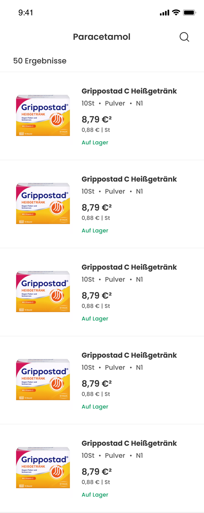
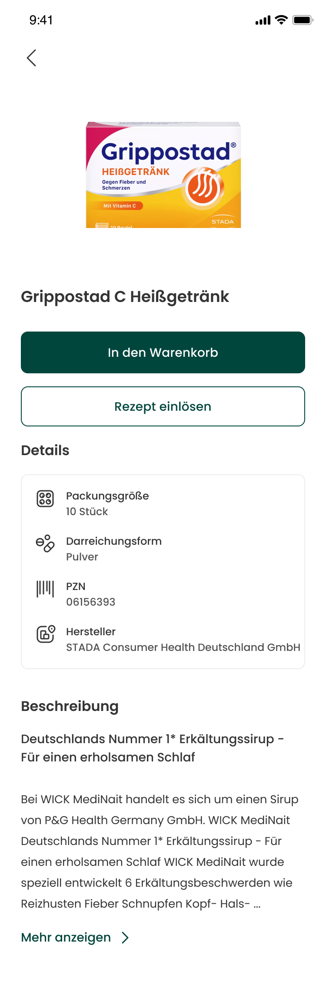
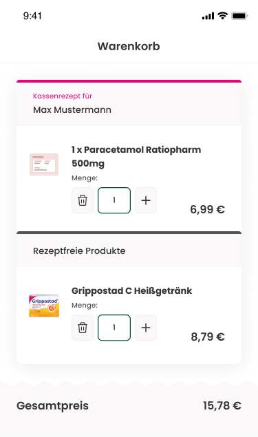
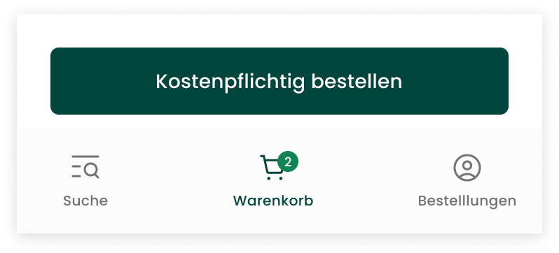
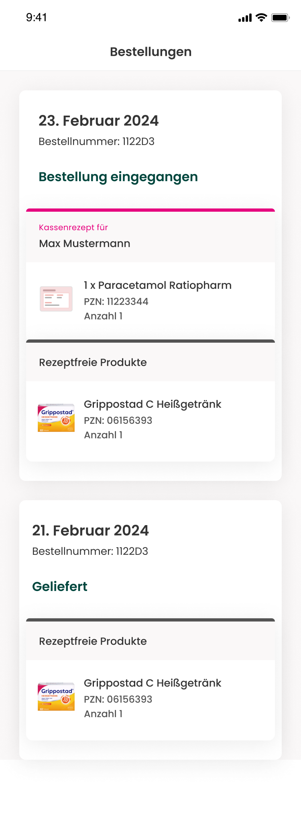
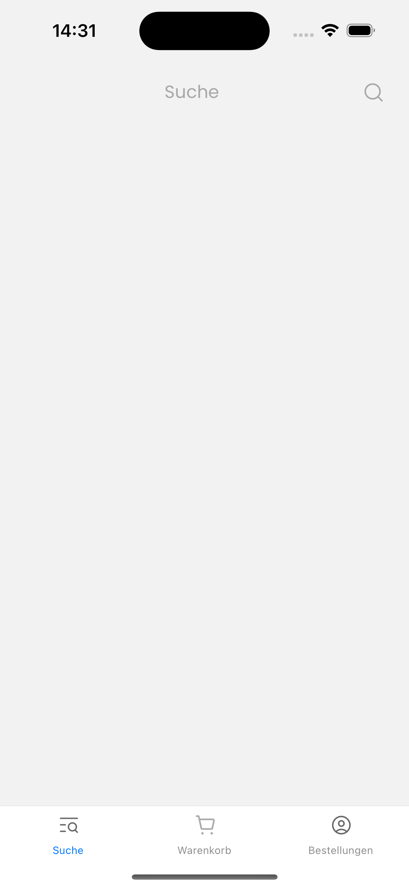
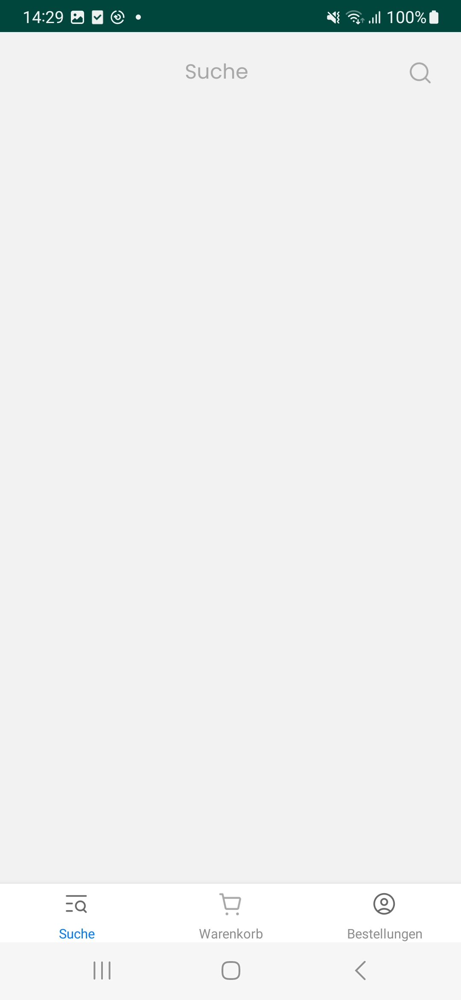

Hi there!

We are delighted that you decided to take part in our coding challenge, and we cannot wait to see your result!

This coding challenge is designed in a way that it reflects very realistically our daily work. 
Therefore, the structure, linting, design and images provided in this challenge are directly taken from our code base. 
Not surprisingly, the main topics covered in this challenge are the heart of every e-commerce app: search and checkout.
Does this sound interesting to you? Great, let's start! :rocket: 

Our UX/UI team put a nice design for you together. It completely follows the look and feel of our app and can be found
[here](https://www.figma.com/file/azs3sQti2mK5bGl7yZ0tBi/Recruitment-Test?type=design&node-id=0%3A1&mode=dev) in Figma. 
**We would need you to implement 4 screens** which cover pretty well the typical purchase flow of a user:

- PLP (product list page)
- PDP (product detail page)
- Cart
- Order history

Note: the design is in German, but we provided all the English translations as comment on the Figma board :relaxed: If you have
any questions, please reach out to us.

Let's have a look at each of those screens:

## Purchase flow ##

### Product list page ###

This is the **landing page** and the first step of a user's purchase flow. Here the user can search for a specific product
by entering a keyword in the search bar. In the screenshot you can see that the user was interested in 'Paracetamol' which returned
50 results. What more you can see is that the product 'Grippostad C Heißgetränk' has a package size of 10 units ('10St'),
can be found as powder ('Pulver') formulation and can be categorized as "N1". Don't worry about categorization too much as it simply describes 
for how many days the package size is sufficient.

If the user has found the wanted product, a tap on it would redirect to the next screen:

### Product detail page ###

This page includes all the important and not so important information of the selected product. You see two buttons here. Both have the 
same function: they put the product into the cart. But there is a difference: 'In den Warenkorb' ('Add to cart') flags
the product as _without prescription_, while 'Rezept einlösen' ('Redeem prescription') flags the product as _public prescription_. 
What does this mean? _Without prescription_ means that you don't need a prescription from your physician to buy a specific product in a pharmacy - 
this is of course only possible for products which don't require prescription at all. In this case, you would need to pay the full price. 
In contrast, _public prescription_ refers to products where you have a prescription from your physician and which then is covered partially by your health insurance company.
In reality there are even more prescription types, but for this coding challenge let's stick to these two.

### Cart ###

The next step in the purchase flow would be a final check of all the items in the cart before continuing to payment.
Cart screen should be loaded when user taps on the bottom navigation icon with the 'Warenkorb' ('Cart') title.

On the cart screen you see all the products which have been added by the user. They are nicely grouped in 'Kassenrezept für' (public prescription for) and
'Rezeptfreie Produkte' (without prescription). _Public prescription for_ is always assigned to a person, that is why you find a name here.

Products are shown with their title, quantity and price. The quantity can be changed and the product can be removed as well. The quantity is reflected in the 'Cart' icon in the bottom navigation.

If the user decides that the cart does not need any further adjustments, then a tap on the following button ('Kostenpflichtig bestellen' means 'Order with costs') 
concludes the purchase:

Of course, in reality you would be offered a variety of payment options and are prompted to enter your payment details. But let's keep it simple here and
just assume that a tap on that button concludes the purchase.

### Order history ###

This screen can be reached by tapping on the bottom navigation icon with the 'Orders' title. 
It lists all the past orders including additional information as date of the order, order id and order status. As you can see, all the products of an order
are grouped again into 'Kassenrezept für' (public prescription for) and 'Rezeptfreie Produkte' (without prescription).

## Implementation details ##

We hope that in the section before you get a good overview of what each screen is doing from a product perspective. Now let's get to the fun part and 
talk about some technical details you should consider when implementing the screens:

### Product list page ###

- Infinite scroll with automatic loading of more results once the end of the screen is reached
- Maximum 10 products per load
- Tap on a product directs the user to the product detail page

### Product detail page ###

- If product is not in stock, please grey out the buttons
- 'In den Warenkorb' ('Add to cart') puts the product into the basket and flags it as _without prescription_
- 'Rezept einlösen' ('Redeem prescription') puts the product into the basket and flags it as _public prescription_
- Note: the product can be flagged **as both** _public prescription_ and _without prescription_
- Every new tap on the buttons leads to an increase of quantity of 1
- Some product descriptions can get very long, so please do not forget to hide the text when it gets too long. We leave it up to you to decide how many characters are acceptable before showing the 'Mehr anzeigen' ('Show more') button.
- Please do not forget that descriptions come with HTML formatting - they need to be considered in React Native as well (more on this in the 'Project setup' section)

### Cart ###

- Products are grouped either into 'Kassenrezept für' ('Public prescription for') or 'Rezeptfreie Produkte' ('Without prescription')
- User can change quantity by tapping on the '+' or '-' button
- '-' button is hidden when quantity reaches 1 - here it is replaced by the trash icon to remove the product
- Removing the product is only possible and icon is only shown when quantity is 1
- Cart icon in the bottom navigation shows the number of products in the cart
- The final button to checkout, 'Kostenpflichtig bestellen' ('Order with costs') is fixed, i.e. it does not move when scrolling through the list of products
- Once the button is hit, the user is redirected to the 'Orders' screen where the most recent order as well as all the past orders are listed 

### Order history ###

- Please limit the maximum number of orders in that list to 10 (no more!)
- For the order delivery status you can decide what to show for what order (maybe you assign the status just randomly)

## Project setup ##

Don't worry, you don't have to start from scratch. We provide you with a working version of the app which includes 
basic navigation, functionless search bar and basic styling.

Furthermore we provide you with a `products.json` file (`src/app/lib`) which includes all the necessary information for 59 products. You can retrieve them by 
using the function `getProducts` (`src/app/api/getProducts.ts`). This way, you don't need to do any external api calls or setup a server. We really want you to focus on the screens :wink:

You can install and run the app by using the following commands at the `./src` level:

Android:
- `npm install`
- `npm run da`

iOS:
- `npm install`
- `cd ios`
- `pod install`
- `npm run di`

## Expectations ##

- We do love to see you finishing all the screens. But we know that it can be hard to accomplish when having a full-time job in parallel. Therefore, please complete as much as possible **within one week** and then call it a day. 
- In order for us to compare your work with other's, please **finish the screens in the sequence** already described above: PLP > PDP > Cart > Order history
- **Important:** We do expect you to write a component test for at least one of the screens of your choice
- Feel free to use **any third-party packages**, but be prepared to have questions on why you made your choice
- Feel free to change the folder structure or rename files - we are always curious to learn how things can be improved or done differently :blush:
- We do **encourage you to reach out** if you have questions or are stuck for a longer period. You would do that also at work, right? :smiley: Therefore, please consider this coding challenge as a mutual and friendly way to getting to know each other! We are **more than happy** to set up a pair session with you to discuss or even debug together!
- **Important:** please download the repository as `.zip` file and push your final code into **your own** repository. Please create a pull request and share with us the link - thank you :pray:
- Lastly, **have very much fun!** :smile:

## Optional ##

The following tasks are purely optional, but if you are super fast :rocket: and motivated, feel free to implement the following features:

- We are using a NestJS backend - so why don't you set up a NestJS server which handles the product data? Feel free to use either the provided JSON or any database
- So far all the screens are in German, why not having them in English as well? We would love to see how you would implement the translation switch
- We are using MobX as state management tool. Why not doing the same?
